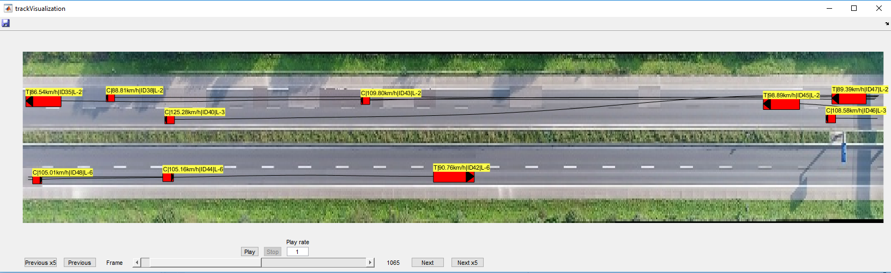

## highD Tools
This repository contains a collection of functions to handle highD data files implemented in [Matlab](./Matlab/README.md) and [Python](./Python/README.md).
The functionality ranges from data handling to visualizing the data.

